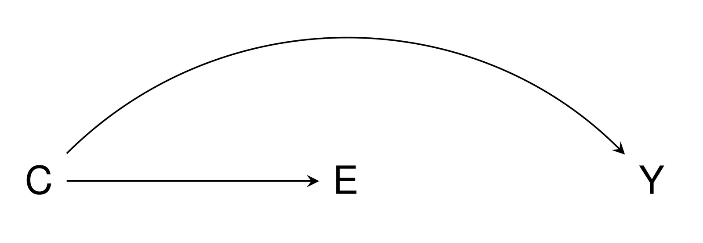
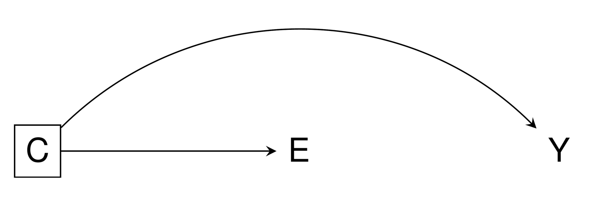
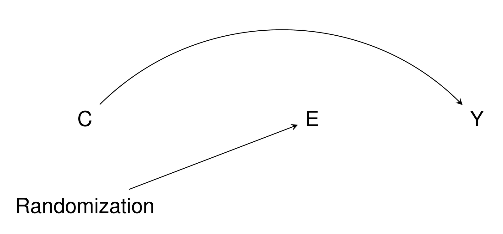
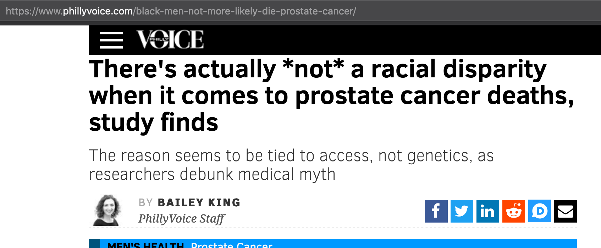
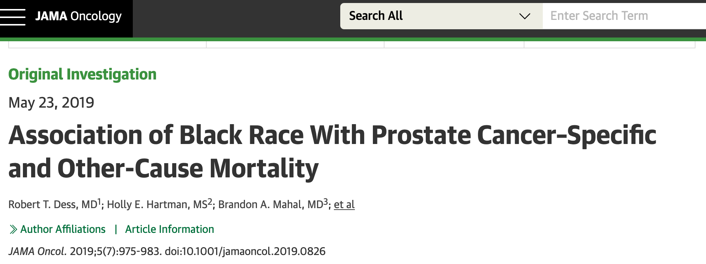
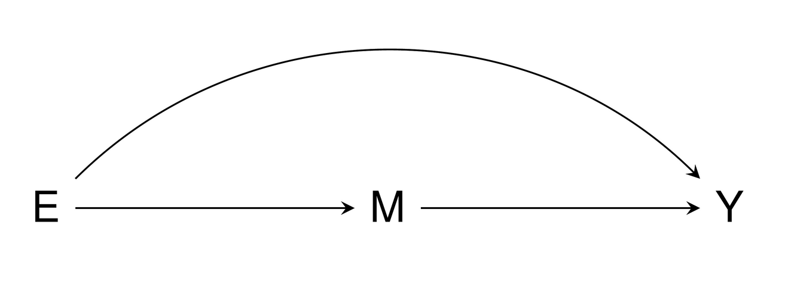
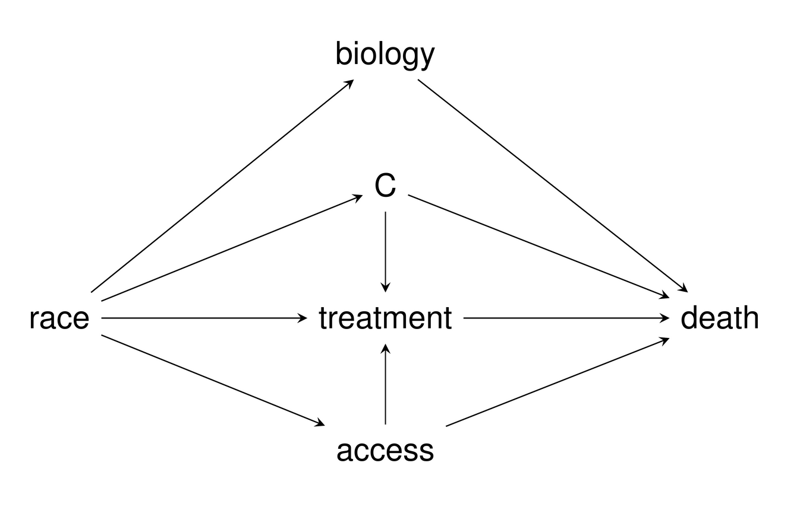
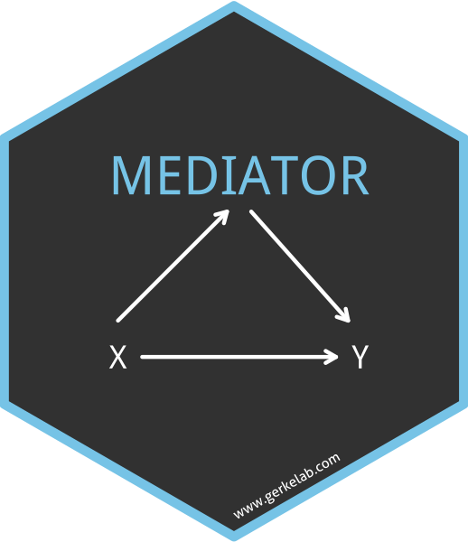

```{r setup, include=FALSE}
knitr::opts_chunk$set(
  fig.width = 10, fig.height = 6, fig.retina = 2,
  warning = FALSE, message = FALSE
)
```

class: left bottom hide-count
background-image: url(figures/moffittlogo.png)
background-size: 22%
background-position: bottom 5% right 5%

<div class="talk-logo"></div>

.talk-meta[
.talk-title[
# Overcooked models <br> .smaller[Mixing prediction, explanation, confounders, and mediators]
]

.talk-author[
Travis Gerke, ScD<br>
.small[@travisgerke]
]

.talk-date[
<!--September 27, 2019-->
]
]

```{css, echo=FALSE}
.talk-logo {
  width: 150px;
  height: 174px;
  position: absolute;
  top: 5%;
  left: 5%;
  background-image: url('figures/GerkeLab-300dpi.png');
  background-size: cover;
  background-repeat: no-repeat;
}
.talk-meta {
  font-family: Overpass;
  position: absolute;
  text-align: left;
  bottom: 10px;
  left: 25px;
}
.talk-author {
  color: #444;
  font-weight: bold;
  font-size: 1.5em;
  line-height: 1em;
}
.talk-date {
  color: #666;
  font-size: 1.25em;
  line-height: 0;
}

.hide-count .remark-slide-number {
  display: none;
}

```

---

background-image: url(figures/allcancers.png)
background-size: 70%
background-position: bottom 20% center

## Motivating example: prostate cancer

---

background-image: url(figures/autopsy.png)
background-size: 45%
background-position: bottom 10% center

## More men die with prostate cancer than from it

- 5-year survival $\approx$ 98% and <10% of prostate cancer patients have fatal disease<br><br>
- 2.9 million men living with a diagnosis in US
  + 42 million latent (undiagnosed) cases!

```{css, echo=FALSE}
.footer-1 {
  position: absolute;
  top: 40%;
  left: 34%;
}
```
.footer-1[.smaller[Jahn et al. _Int J Cancer_ 2015]]

---

background-image: url(figures/incidence.png)
background-size: 55%
background-position: bottom 10% center

## PSA screening trends determine cancer incidence

- PSA screening $\longrightarrow$ high rates of overdiagnosis and overtreatment
  + Up to 2/3 of prostate cancers are overdiagnosed, most are treated<sup>.smaller[1]</sup>
```{css, echo=FALSE}
.footer-2 {
  position: absolute;
  top: 28%;
  left: 75%;
}
```
.footer-2[.smaller[1\. Loeb et al. _Eur Urol_ 2014]]

---

background-image: url(figures/survFigure.png)
background-size: 55%
background-position: bottom 5% center

## An urgent clinical challenge

- How can we distinguish indolent from lethal disease?
  + Patients with indolent tumors could avoid overtreatment
  + Patients with potentially lethal tumors could receive timely treatment
  
```{css, echo=FALSE}
.footer-3 {
  position: absolute;
  top: 93%;
  left: 55%;
}
```
.footer-3[.smaller[Pettersson<sup>∗</sup>, Gerke<sup>∗</sup>, et al. _Cancer_, 2017]]

---

background-image: url(figures/mystery.gif)
background-size: 45%
background-position: bottom 10% center

## A different(???) clinical challenge

- What are the causes of lethal disease?
  + If we know these, won't we also know the answer to the previous question, "How can we distinguish indolent from lethal disease?"

---

background-image: url(figures/complicated.gif)
background-size: 80%
background-position: bottom 20% center

## It's complicated.

---

background-image: url(figures/explainpredict.png)
background-size: 90%
background-position: bottom 20% center

## Good prediction models $\ne$ good causal models

---

## Explanatory modeling = causal inference

- Test causal hypotheses for mechanistic understanding
  + Randomized experiments/trials are a gold standard
  + Increasingly, causal inference is conducted by evaluating association patterns within observational data according to specific rules
  + Success: an understandable statistical model (e.g. regression) that fits data well according to an expert-guided mechanistic theory
  
## Predictive modeling = predicting future events
- Models that use input values to accurately predict future outputs
  + Study design includes training and validation data sets
  + Success: a model built in the training data which need not be easily interpretable (e.g. neural net) works well in the validation data

---

background-image: url(figures/appendix.png)
background-size: 60%
background-position: bottom 20% center

## Proof that good prediction $\ne$ good explanation

- TL;DR version: prediction error is a tradeoff between bias and variance. You can use a biased model (in a causal sense) that has low variance to reduce error

---

background-image: url(figures/icecream.png)
background-size: 60%
background-position: bottom 20% center

## Simpler for good prediction $\ne$ good explanation

- You can build good prediction models with variables that have nothing to do with mechanism

---

## Correlation is not causation, except when it is

- The previous slide gave a good example of non-causative correlation
  - But I also just said we can use associational patterns to infer causation
  - So, which is it?<br><br>
- Directed acyclic graphs (DAGs) help understand when correlation == causation
  - The most basic rule is that association flows through edges
  - When two nodes are connected, we observe a statistical association
  - When association persists when all spurious edges between two variables are blocked, the observed association is causal

.pull-left[

]

.pull-right[

]

---

background-image: url(figures/appshot.png)
background-size: 70%
background-position: bottom 20% center

## DAGs: there's an app for that
- There are rules governing how association flows beyond the scope of this talk
  + [https://apps.gerkelab.com/shinyDAG/](https://apps.gerkelab.com/shinyDAG/)

---

## Example: Randomized trials as a gold stardard

- Randomized experiments provide causal effect estimates
  + Here's a DAG for an RCT under the null
  + Boilerplate explanation: "Because randomization adjusts for all confounders"<br><br>
- _Very important definition:_ A confounder is a common cause of exposure and outcome

.pull-left[

]

.pull-right[

]

```{css, echo=FALSE}
.footer-4 {
  position: absolute;
  top: 72%;
  left: 70%;
  color: #FF0000;
}
```
.footer-4[NO!]

---

background-image: url(figures/deathrates.png)
background-size: 90%
background-position: bottom 20% center

## Back to the motivating example: PCa disparities

---

background-image: url(figures/notrisk.png)
background-size: 90%
background-position: bottom 10% center

## An artifact? "Confounding"?

.pull-left[

]

.pull-right[

]

---

background-image: url(figures/racedag.png)
background-size: 70%
background-position: bottom 1% center

## Let the DAG help us know what to do!
- Are there confounders of race?

---

background-image: url(figures/confounders.png)
background-size: 90%
background-position: bottom 25% center

## Oops.

---

background-image: url(figures/ncdb.png)
background-size: 80%
background-position: bottom 10% center

## Let's try again
- 1,380,357 prostate cancer patients in NCDB
  + After subsetting to those with complete follow-up, created a density-matched 1:1 case-control sample of 12,256 patients
  + Crude analysis by race: HR for death of 1.30 (95% CI: 1.18-1.44) comparing black to white patients
  
---

<!--background-image: url(figures/mediatorhex.png)
background-size: 8%
background-position: bottom 10% left 40%-->

## How to properly think about the role of access

- Another _very important definition_: A mediator is a variable caused by exposure, which in turn, causes the outcome
  + Effects can then be separated into _direct_ and _indirect_ components
  + Methods for mediation analyses are a distinct branch of statistics
  + Recommended resource: VanderWeele 2015 _Explanation in Causal Inference_
  + For implementation in R, [https://github.com/GerkeLab/mediator](https://github.com/GerkeLab/mediator)
  
.pull-left[

]

.pull-right[

]

---

background-image: url(figures/fullmodel.png)
background-size: 30%
background-position: bottom 10% right 15%

## Effect of race is minimally mediated by access

- One way to measure this is through insurance status
  + The proportion of race effect mediated through insurance status $\approx 1$%
  + We needed to adjust for many mediator-outcome confounders 
  + [Hand-wave over other nuances &#x1F44B;]
  + [Can discuss these at conclusion]
  
.pull-right[

]

---

background-image: url(figures/auc.png)
background-size: 40%
background-position: bottom 10% center

## The published effort is still useful

- Turns out, it's a decent predictive model!
  + The below is AUC on a 20% hold-out validation data set from a simple logistic regression with all included factors
  + And we be even better if we used more modern machine learning

---
background-image: url(figures/ack.png)
background-size: 60%
background-position: bottom 70% center

## The real heroes 

<br><br><br><br><br><br><br><br><br>
## Further details
- https://www.gerkelab.com/
- https://github.com/gerkelab
